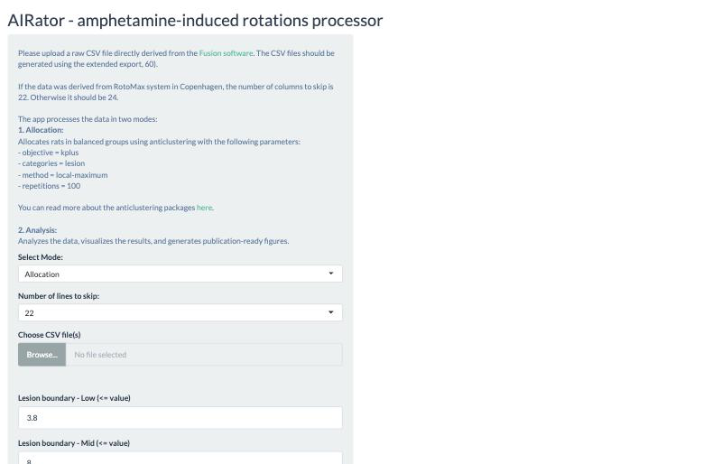
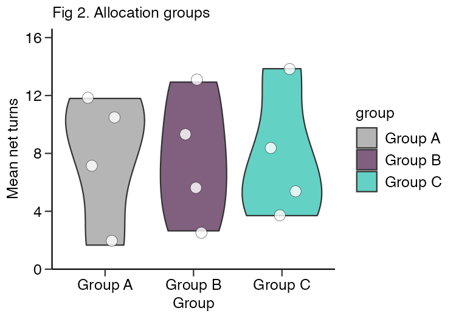
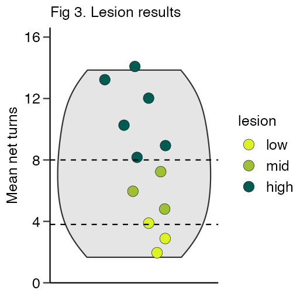

# AIRator

Automatic processing of amphetamine-induced rotation (AIR) data.

AIRator is an R Shiny app that reads raw CSV exports from the
[Fusion software](https://omnitech-usa.com/product/fusion-software/) and turns
them into balanced experimental groups and publication-ready figures.

**Live app:** <https://hdm4xa-alrik-sch0rling.shinyapps.io/airator/>



## Input format

Upload one or more raw CSV files produced by Fusion's **extended export (60)**.
The app skips the instrument header before reading the table:

| System | Header lines to skip |
| ------ | -------------------- |
| RotoMax (Copenhagen) | 22 |
| Other systems | 24 |

The following columns are required after the header: `EXPERIMENT`, `SUBJECT.ID`,
`NET.TURNS`, `SAMPLE`. Any of `ROTOR`, `DURATION..s.`, `SUBJECT.TYPE`,
`START.TIME`, `CLOCKWISE.TURNS`, `COUNTER.CLOCKWISE.TURNS`, `REASON.REJECTED`
and `X` are dropped if present.

## Allocation mode

Animals are summarised to a mean net-turns value, binned by lesion severity, and
then assigned to groups with the
[`anticlust`](https://cran.r-project.org/web/packages/anticlust/vignettes/anticlust.html)
package so that the groups are as similar to one another as possible.

Lesion bins are controlled by two boundaries:

| Bin | Condition | Default |
| --- | --------- | ------- |
| `low`  | `mean_net_turns <= lesion_low` | 3.8 |
| `mid`  | `mean_net_turns <= lesion_mid` | 8.0 |
| `high` | everything above `lesion_mid`  | — |

`anticlustering()` is called with:

- `objective = "kplus"`
- `categories = lesion` — so each group gets a comparable mix of severities
- `method = "local-maximum"`
- `repetitions = 100`

The random seed is fixed at 69, so a given input reproduces the same allocation.

### Outputs

| Output | Contents |
| ------ | -------- |
| Allocation table (CSV) | per-animal mean net turns, SEM, lesion bin, assigned group |
| Fig 1 (PDF) | net turns over time, faceted per animal, coloured by group |
| Fig 2 (PDF) | distribution of mean net turns per allocated group |
| Fig 3 (PDF) | overall distribution with lesion boundaries marked |

### Example output

Produced from a 12-animal test dataset. Left: mean net turns per allocated
group. Right: the same animals coloured by lesion bin, with the two boundaries
marked.

| Fig 2 — allocation groups | Fig 3 — lesion bins |
| --- | --- |
|  |  |

## Analysis mode

> **Known limitation.** Analysis mode currently computes per-week, per-group
> summaries but does not yet render any figures or tables — the three plots are
> produced for allocation mode only. Use allocation mode for now.

## Running locally

Dependencies are pinned with [renv](https://rstudio.github.io/renv/). Clone the
repository, restore the library, then start the app:

```bash
git clone https://github.com/alrikschorling/AIRator.git
cd AIRator
R -e 'renv::restore()'
R -e 'shiny::runApp(launch.browser = TRUE)'
```

`renv::restore()` installs the exact package versions recorded in `renv.lock`
into a project-local library, so it will not disturb your system R installation.
It only needs to be run once, or after `renv.lock` changes.

## License

[MIT](LICENSE)
