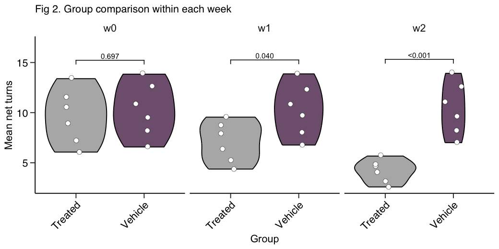
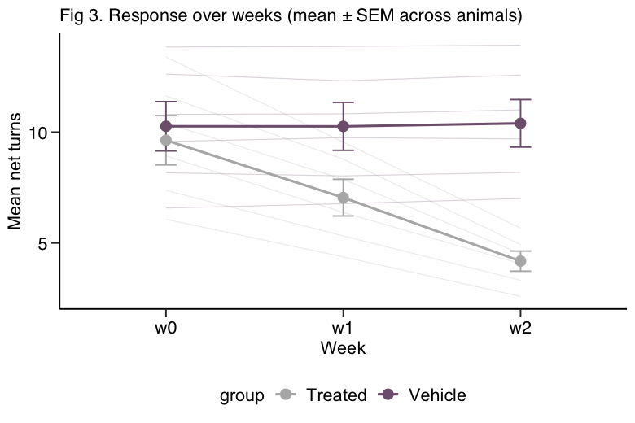

# AIRator

Automatic processing of amphetamine-induced rotation (AIR) data.

AIRator is an R Shiny app that reads raw CSV exports from the
[Fusion software](https://omnitech-usa.com/product/fusion-software/) and turns
them into balanced experimental groups and publication-ready figures.

**Live app:** <https://hdm4xa-alrik-sch0rling.shinyapps.io/airator/>


## Input format

Upload one or more raw CSV files produced by Fusion's **extended export (60)**.
The app skips the instrument header before reading the table:

| System | Header lines to skip |
| ------ | -------------------- |
| RotoMax (Copenhagen) | 22 |
| Other systems | 24 |

The following columns are required after the header: `EXPERIMENT`, `SUBJECT.ID`,
`NET.TURNS`, `SAMPLE`. Any of `ROTOR`, `DURATION..s.`, `SUBJECT.TYPE`,
`START.TIME`, `CLOCKWISE.TURNS`, `COUNTER.CLOCKWISE.TURNS`, `REASON.REJECTED`
and `X` are dropped if present.

## Example data

[`example-data/`](example-data) holds three synthetic Fusion exports —
`example_w0.csv`, `example_w4.csv` and `example_w8.csv` — covering 12 animals
over three timepoints. Use `example_w0.csv` alone to try allocation mode, or all
three together for analysis mode. Set **lines to skip** to 24.

They are generated by [`data-raw/make_example_data.R`](data-raw/make_example_data.R)
and contain no real experimental data. The generator reproduces the structure and
statistical behaviour of a real export: the 24-line header, quarter-turn
quantisation, a response that rises over the first hour and plateaus,
strongly autocorrelated successive minutes, and one animal that rotates the
other way and so has a negative session mean.

## Allocation mode

Animals are summarised to a mean net-turns value, binned by lesion severity, and
then assigned to groups with the
[`anticlust`](https://cran.r-project.org/web/packages/anticlust/vignettes/anticlust.html)
package so that the groups are as similar to one another as possible.

Lesion bins are controlled by two boundaries:

| Bin | Condition | Default |
| --- | --------- | ------- |
| `low`  | `mean_net_turns <= lesion_low` | 3.8 |
| `mid`  | `mean_net_turns <= lesion_mid` | 8.0 |
| `high` | everything above `lesion_mid`  | — |

`anticlustering()` is called with:

- `objective = "kplus"`
- `categories = lesion` — so each group gets a comparable mix of severities
- `method = "local-maximum"`
- `repetitions = 100`

The random seed is fixed at 69, so a given input reproduces the same allocation.

### Outputs

| Output | Contents |
| ------ | -------- |
| Allocation table (CSV) | per-animal mean net turns, SEM, lesion bin, assigned group |
| Fig 1 (PDF) | net turns over time, faceted per animal, coloured by group |
| Fig 2 (PDF) | distribution of mean net turns per allocated group |
| Fig 3 (PDF) | overall distribution with lesion boundaries marked |

### Example output

Produced from a 12-animal test dataset. Left: mean net turns per allocated
group. Right: the same animals coloured by lesion bin, with the two boundaries
marked.

| Fig 2 — allocation groups | Fig 3 — lesion bins |
| --- | --- |
|  |  |

## Analysis mode

Compares treatment groups over time. Upload **one file per timepoint**, label
each file with its week, and assign every animal to a group.

Each animal contributes **one value per week** — its mean net turns across the
session. That is the unit of analysis, so error bars show variation between
animals. (Summarising directly from the per-minute rows would treat every
minute as an independent observation and understate the SEM roughly sevenfold
for a 90-minute session.)

Weeks are ordered by upload order rather than alphabetically, so `w2` sorts
before `w10`.

### Group comparison

Within each week the groups are compared, and the test is chosen from the data.
Normality is assessed on the within-group residuals — the assumption the t-test
and ANOVA actually make — and equality of variance with Levene's test:

| Residuals | Variance | Groups | Method |
| --------- | -------- | ------ | ------ |
| non-normal | — | 2 | Wilcoxon rank-sum |
| non-normal | — | 3+ | Dunn's test (BH-adjusted) |
| normal | unequal | 2 | Welch's t-test |
| normal | unequal | 3+ | Games-Howell |
| normal | equal | 2 | Student's t-test |
| normal | equal | 3+ | ANOVA + Tukey HSD |

The app reports which test it used for each week. Each week is decided
independently, so different weeks may use different tests.

> Weeks are compared **independently**. This does not model the correlation
> between repeated measurements on the same animal — if you need a
> week × group interaction term, fit a repeated-measures model on the exported
> summary.

### Outputs

| Output | Contents |
| ------ | -------- |
| Analysis summary (CSV) | per week and group: n, mean net turns, SEM, plus every pairwise test |
| Fig 1 (PDF) | session time course, group mean ± SEM, faceted by week |
| Fig 2 (PDF) | per-week group comparison with p-values |
| Fig 3 (PDF) | response over weeks, with individual animal trajectories |

### Example output

A 12-animal, 3-week test dataset in which the treated group improves while the
vehicle group does not.





## Running locally

Dependencies are pinned with [renv](https://rstudio.github.io/renv/). Clone the
repository, restore the library, then start the app:

```bash
git clone https://github.com/alrikschorling/AIRator.git
cd AIRator
R -e 'renv::restore()'
R -e 'shiny::runApp(launch.browser = TRUE)'
```

`renv::restore()` installs the exact package versions recorded in `renv.lock`
into a project-local library, so it will not disturb your system R installation.
It only needs to be run once, or after `renv.lock` changes.

## Tests

```bash
Rscript tests/run-tests.R
```

The suite drives the app through `shiny::testServer` against the example data
and covers both modes: lesion binning, allocation balance and reproducibility,
the per-animal aggregation and per-week comparisons, the validation guards, and
that every figure builds and downloads as a valid PDF. It needs no packages
beyond the app's own, and runs on every push via
[GitHub Actions](.github/workflows/tests.yml).

## License

[MIT](LICENSE)
